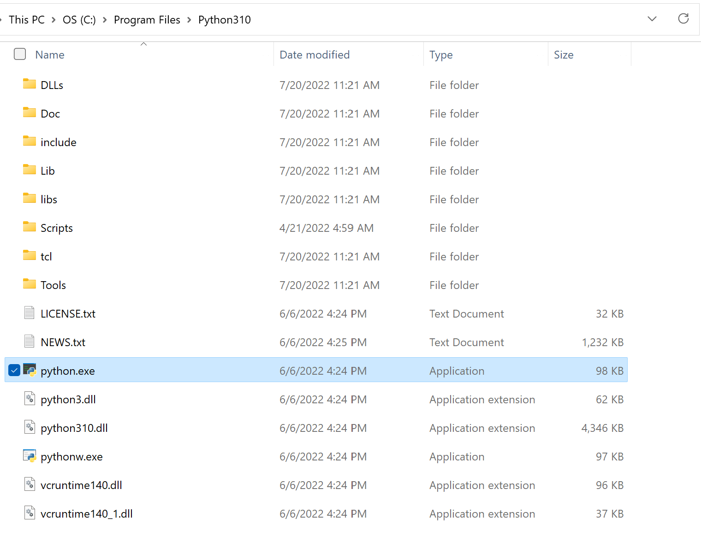

### Table of Contents

- [Installation](#installation)
  - [Installing Python](#installing-python)
  - [Adding Python to PATH](#adding-python-to-path)
  - [Virtual Environments](#virtual-environments)
    - [What is a Virtual Environment?](#what-is-a-virtual-environment)
    - [Creating a Virtual Environment](#creating-a-virtual-environment)
    - [Activating/Deactivating the Virtual Environment](#activatingdeactivating-the-virtual-environment)
  - [Installing Packages](#installing-packages)

# Installation

## Installing Python

---

To check whether or not Python is installed on your computer, run the following command in the command line:

```
> py --version
```

If Python is installed, you should be able to see the current version and you can skip ahead to [installing the virtual environment](#installing-the-virtual-environment).

```
C:\Users\Wilson> py --version
Python 3.10.5
```

If instead you get the following error, you either need to install Python or add it to your PATH environmental variable:

```
C:\Users\Wilson> py --version
'py' is not recognized as an internal or external command,
operable program or batch file.
```

You can download Python through this [link](https://www.python.org/downloads/).

## Adding Python to PATH

---

Once you've downloaded Python, you need to add it to your PATH, a system environmental variable which stores directories that allow the system to run executables without specifying a path from the command line.

To add it to PATH, first you need to find the location of the `python.exe` file that you've downloaded. You can do this by searching up `python` in the Windows search bar and clicking on `Open file location`. In the new window, if the highlighted file is a shortcut, you need to right click and choose `Open file location` again. You should end up in a directory similar to this:




Now click on the directory path near the top of the window and copy it.

Next, search up `path` on the Windows search bar. Then navigate to `Edit the system environmental variables`. Then click on `Environment Variables...` in the new window (near the bottom) or press `n`. Then in the new `Environmental Variables` window, double-click on the `Path` variable in either the `User variables` or `System variables`, depending on whether or not you want this Python version to be active across your user account or all user accounts. Click `New` and paste the path to the directory that you have copied earlier. Now you can exit out of all these windows by pressing `Ok`.

Now if you run the `py --version` command on a NEWLY OPENED command line, you should be able to see the current version.

> Note: If you are running the commands in the VSCode terminal after you've updated your PATH, you may need to restart your computer for the changes to appear.

## Virtual Environments

---

### What is a Virtual Environment?

A virtual environment is one in which the Python interpreter is isolated from all other Python environments (such as the system environment). This means that Python packages installed on the system will not be able to be used in the virtual environment unless you install the packages there as well. This allows you to maintain different Python packages across various projects.

### Creating a Virtual Environment

In the root directory, create a folder containing your virtual environment by running the following command:

```
> py -m venv venv
```

You can change the second `venv` to whatever you want your virtual environment to be called but a common name for it is `venv`.

Make sure this folder is not pushed to version control by adding `venv/` to `.gitignore`.

### Activating/Deactivating the Virtual Environment

Run the command `.\venv\Scripts\activate` to activate the environment. You should now see that every new line in the terminal starts with `(venv)`.

Deactivate the environment with the command `deactivate`.

## Installing Packages

---

In Python, the package manager and installer is `pip` which is analagous to Node.js' `npm`.